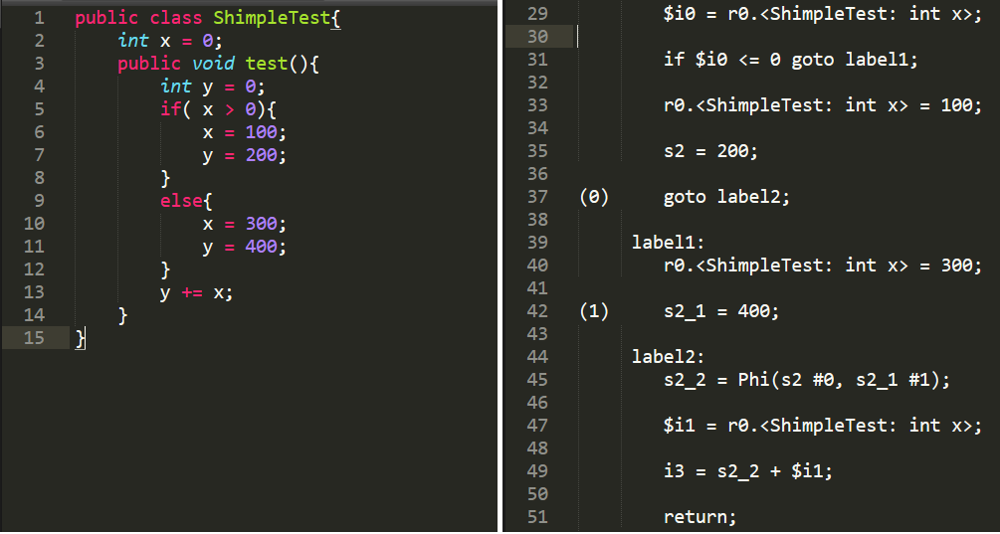

## 《软件分析测试》作业——部分SSA转换

- MF1933092 王国新

### 实验说明

- 采用[Soot]( http://sable.github.io/soot/ ) 对由 Java 语言编写的程序`ShimpleTest.java`进行SSA转换。
- Soot工具版本为[sootclasses-trunk-jar-with-dependencies]( https://soot-build.cs.uni-paderborn.de/public/origin/develop/soot/soot-develop/build/ )

### 实验过程

通过顺序执行以下两条命令，可生成经过SSA转换转换的中间代码，结果保存在./sootOutput 中。

```shell
Javac ShimpleTest.java
java -jar sootclasses-trunk-jar-with-dependencies.jar -cp . -pp -f shimple ShimpleTest
```

### 实验结果

下图中，左边为源代码`ShimpleTest.java`，右边为生成的中间代码`ShimpleTest.shimple`的部分截图，对应于源代码中5~13行代码。

可以看到，变量`x`在中间代码始终由`r0.<ShimpleTest: int x>`来表示，没有经过SSA转换；而变量`y`在中间代码中由`s2`、 ` s2_1`、 `s2_2`等多个变量来表示，且每个变量只赋值一次，满足SSA转换。因此构造出的程序完成了部分SSA转换。



### 参考资料

官方教程 https://github.com/Sable/soot/wiki/A-brief-overview-of-Shimple 
